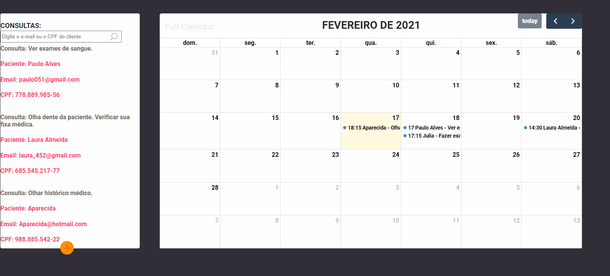

<h1 align="center" style="text-align: center; font-weight: bold;">Calendar + MongoDB</h1>
<p align="center">Plataforma de agendamento generico utilizando nodeJS e MongoDB. Essa plataforma trabalha com envios de e-mail agendados. Faltando 1hr para a consulta é enviado um e-mail de lembrete para o paciênte.  </p>

## Demo 📸

<div align="center" >
  

</div>

---

### 🛠 Tecnologias

Tecnologias usadas na construção do projeto:

- [body-parser](https://www.npmjs.com/package/body-parser)
- [ejs](https://ejs.co/)
- [Express](https://expressjs.com/)
- [mongoose](https://mongoosejs.com/)
- [nodemailer](https://nodemailer.com/about/)
- [FullCalendar](https://fullcalendar.io/)
- [jQuery Mask Plugin](https://igorescobar.github.io/jQuery-Mask-Plugin/)

---

### Pré-requisitos

Você vai precisar ter instalado em sua máquina as seguintes ferramentas:
[Git](https://git-scm.com), [Node.js](https://nodejs.org/en/).
E um editor de código.

### 🎲 Rodando a Aplicação

```bash
# Clone este repositório
$ git clone https://github.com/cesaraugustomt/Scheduling_Platform
# Acesse a pasta do projeto no terminal/cmd
$ cd Scheduling_Platform

# Instale as dependências
$ yarn
# ou
$ npm install

# Execute a aplicação em modo de desenvolvimento
$ node index.js
# ou
$ nodemon index.js

# entre no link
http://localhost:8080/


```
